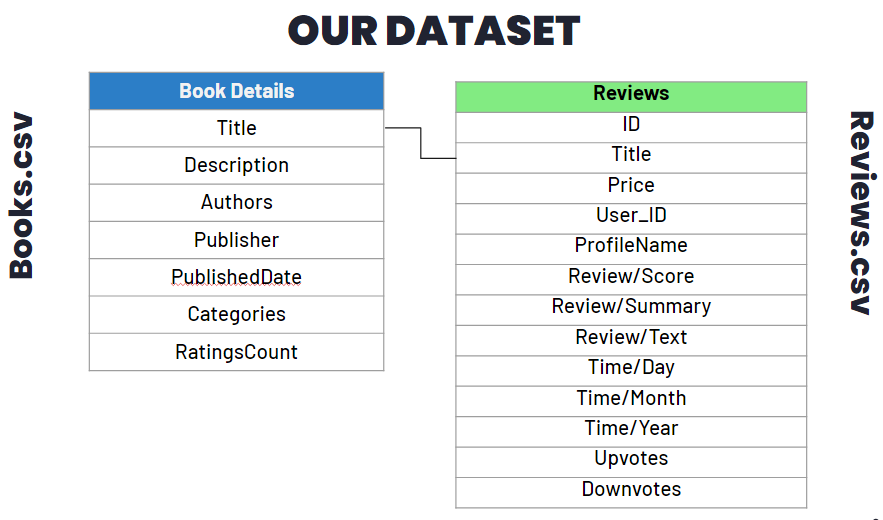
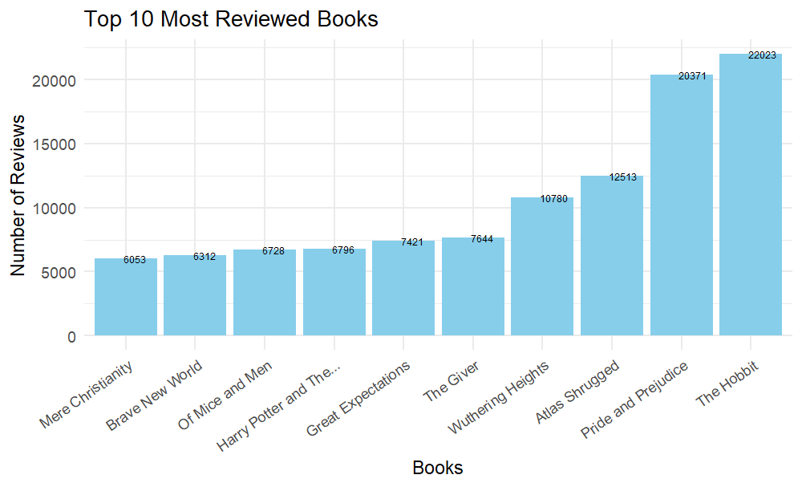
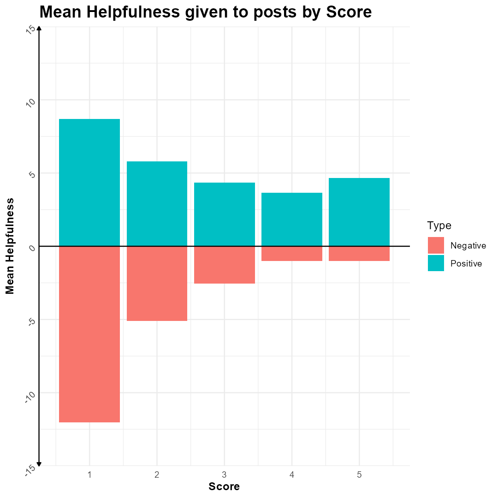
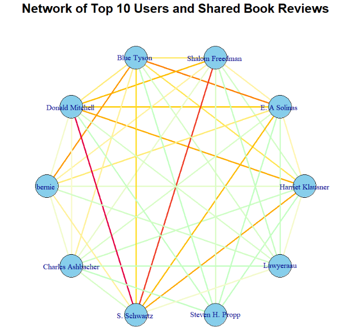

# Data-Analysis-on-Amazon-Books

This is the public repository for the project that we presented for our Data Management and Analysis Unit 2 class in the BSc in Applied Computer Science and Artificial Intelligence at the University of Rome - Sapienza.

## Authors

- [Nil Atabey](https://github.com/NilAtabey)
- [Julio Zenelaj](https://github.com/juve-938383)

## Presentation

You can view our project presentation [here](Presentation/Data%20Analysis%20on%20Amazon%20Books.pdf).

## Project Overview

### Dataset
We used [this dataset](https://www.kaggle.com/datasets/mohamedbakhet/amazon-books-reviews/data) from 2022 which contains ~3 million user reviews and ~210 thousand books. For our analysis, we modified this dataset to suit our specific needs better.

Here is what our modified dataset looks like


### Objective
The primary objective of this project is to perform a comprehensive data analysis on a dataset of Amazon book reviews. This analysis aims to uncover insights into the relationships between various factors such as genre, author, and user engagement with the reviews, ratings, and reception of books on Amazon. All analyses and visualizations are conducted using R.

### Key Research Question
What is the relationship between factors such as genre, author, and user engagement with the reviews, ratings, and reception of books on Amazon?

## Some Examples



*Image 1: Top 10 Most Reviewed Books*


*Image 2: Sentiment Analysis on 500K reviews*


*Image 3: Market margins in percentage vs review density of books percentage*



*Image 4: Helpfulness Of A Comment vs Scores Given (1-5)*



*Image 5: Network of top 10 users, darker colour indicates more reviews in common*

## Repository Structure

- Each file includes one type of analysis
- All files list imports, loads, analyses and visualization in order, you can modify them accordingly

## Getting Started

1. Clone the repository:
   ```bash
   git clone https://github.com/NilAtabey/Data-Analysis-on-Amazon-Books.git
2. Or you can download each analysis individually. Make sure to change the working directories
   ```R
   # Load the datasets for books and reviews
    reviews <- fread("C:/Users/YourUser/FolderLocation/reviews.csv")
    books <- fread("C:/Users/YourUser/FolderLocation/books.csv")

## Prerequisites

Make sure you have the following installed:
- R (version 4.0 or higher)
- R Studio or equivalent IDE
- R packages: dplyr, ggplot2, data.table, igraph, tidyverse, and any other packages specified in the scripts.
- Minimum Hardware Prerequisites are 4GB of RAM or more (preferably 8GB) since the **reviews** dataset itself is ≈3GB

## Contributions

Contributions to this project are welcome. Please fork the repository, create a new branch, and submit a pull request with your changes.

## License

This project is licensed under the MIT License. See the LICENSE file for details.

## Contact

For any questions or comments, please open an issue in this repository or contact us directly.
